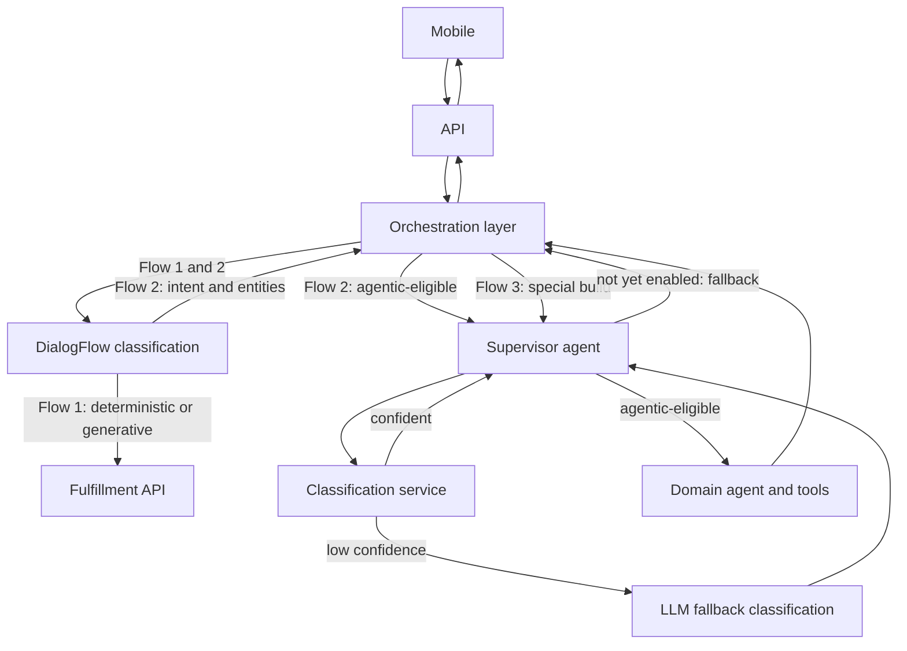
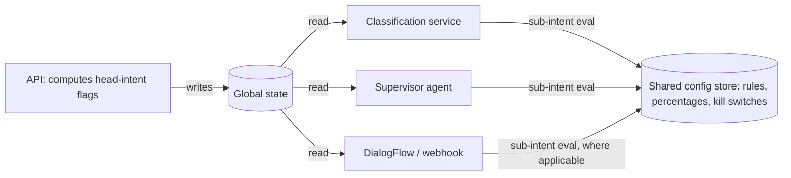

# High-Level Design: Feature Flag & Rollout Strategy for Agentic Migration

**Status:** Draft for review
**Audience:** Orchestration (API), Supervisor Agent, Classification Service, DialogFlow/Conversational Design teams

---

## 1. Purpose

Define how eligibility (feature flags / rollout switches) is evaluated, managed, and propagated across the virtual assistant's migration from a DialogFlow-only architecture to a hybrid architecture supporting deterministic, generative-on-DialogFlow, and agentic (LLM-based) flows — at **head-intent** and **sub-intent** granularity, targeted by user group (pilot / employee / customer), language, and gradual customer percentage rollout (10% → 100%).

## 2. Background

### 2.1 Current architecture

```
Mobile -> API -> Orchestration layer -> Google DialogFlow -> Fulfillment API -> (reverse)
```

Eligibility flags/switches are owned and evaluated by **API**, before intent is known. DialogFlow performs intent classification and, since it already has feature-flag state available to it, uses that state to decide how to route a given flow. There is no separate rollout service in the current system — DialogFlow does not call anything for this; it reads from state already made available to it.

### 2.2 Migration goal

Introduce an LLM-based agentic system alongside DialogFlow, migrated gradually, intent by intent, sub-intent by sub-intent — without requiring a redesign of the flag/rollout mechanism when this happens, and without requiring shared code between Java (Orchestration/API) and Python (Supervisor agent, Classification service).

## 3. Target architecture — three supported flow types

### Flow 1 — Deterministic and generative flows on DialogFlow (unchanged shape)

```
Mobile -> API -> Orchestration layer -> DialogFlow -> Fulfillment API -> (reverse)
```

- **Deterministic sub-flows**: already fully rolled out to all users. No gradual rollout required — effectively unflagged (or flagged "stable / 100%").
- **Generative sub-flows built on DialogFlow**: still require flags and targeting controls (group, language, percentage) even though the flow shape is unchanged.

### Flow 2 — Existing/new capabilities migrated to agentic, DialogFlow still classifies

```
Mobile -> API -> Orchestration layer -> DialogFlow (classification only)
       -> back to Orchestration layer (intent + entities)
       -> Orchestration layer -> Supervisor agent -> Domain agent -> Tools
```

- DialogFlow performs classification, then hands intent + entities back to the Orchestration layer.
- The response bypasses DialogFlow on the way back — the Supervisor agent returns directly to the Orchestration layer.
- DialogFlow (or the fulfillment webhook, for entity-driven sub-intents) can also read eligibility state directly and decide whether to handle the request itself or hand off to the Orchestration layer for agentic handling.

### Flow 3 — Special app build, agentic-first

```
Mobile -> API -> Orchestration layer -> Supervisor agent -> Domain agent -> Tools
```

- No DialogFlow involvement at all.
- The Supervisor agent calls a **Classification Service** (ML-based intent/entity extraction) first.
- If the Classification Service cannot classify with sufficient confidence, the Supervisor agent falls back to using an LLM for classification.
- If, after classification, the resolved intent/sub-intent is not yet enabled for agentic handling, the Supervisor agent hands the request back to the Orchestration layer to be routed through the legacy DialogFlow/fulfillment path (fallback).



## 4. Design principles

1. **Evaluation timing follows knowability, not org boundaries.** Head-intent eligibility is knowable before classification (the set of domains is small and enumerable), so it is precomputed by API for every domain a user could touch, and propagated via existing global state. Sub-intent eligibility is only knowable after classification, so it is evaluated by whichever component resolves the sub-intent.
2. **Reuse the existing propagation mechanism.** API already sets flags in global state that DialogFlow reads today. This extends, unchanged in mechanism, to the Classification Service and Supervisor agent, since global state is confirmed reachable by both and is not DialogFlow-coupled.
3. **No shared SDK across Java and Python.** Any evaluation logic that must run in both runtimes (specifically, percentage-bucketing math for sub-intent rollout) is documented as an explicit, versioned specification and tested with shared golden vectors — not distributed as shared code.
4. **Single config authorship, split evaluation.** Head-intent and sub-intent rules are authored and stored in one place, even though they are evaluated by two different components in two different languages. Ops/product should never need to know which runtime evaluates a given rule.
5. **Extensible routing outcome, not a boolean.** A given intent/sub-intent resolves to one of a small, extensible set of routing variants — not simply "agentic on/off" — since Flow 1 alone already needs three outcomes: deterministic legacy, generative-on-DialogFlow, and (eventually) agentic.
6. **No sticky/session decision cache required.** Rollout percentage and rule changes are release-to-release, not real-time, so there is no risk of a user's routing decision changing mid-conversation. This removes the need for a session-scoped decision cache that would otherwise be required under real-time flag changes.
7. **Merge-ready.** Because eligibility propagation rides on existing global state rather than a new bespoke service-to-service contract between Orchestration and Supervisor, a future merge of these two components requires no redesign — it simply reduces the number of distinct readers of global state.

## 5. Detailed design

### 5.1 Head-intent (domain-level) flags

- **Owner:** API
- **Computed:** Before intent classification, per request (or per session), for all domains a user is potentially eligible for.
- **Inputs:** user ID, user group (pilot / employee / customer), language code, app build type (standard vs. special build), current rollout percentage per domain.
- **Output:** written into global state, in the same mechanism used today, readable by DialogFlow, the Classification Service, and the Supervisor agent.
- **Granularity note:** DialogFlow is flow-based, so head-intent-level flags map naturally onto distinguishable pages/routes in DialogFlow CX, or, where a single webhook handles multiple sub-intents from one page, the webhook reads global state directly.

### 5.2 Sub-intent flags

- **Owner (evaluation):** whichever component resolves the sub-intent —
  - DialogFlow (or its fulfillment webhook) for Flow 1 generative sub-flows and Flow 2.
  - The Classification Service, when it classifies with sufficient confidence, for Flow 3.
  - The Supervisor agent, when it falls back to LLM classification, for Flow 3.
- **Owner (config authorship):** a single, shared config store — same store as head-intent rules — so there is one place to view/edit rollout percentages, group targeting, and kill switches regardless of which runtime evaluates them.
- **Output:** a routing variant (see 5.4) plus rule/version metadata for observability.

### 5.3 Percentage rollout — deterministic bucketing

To avoid a user flipping between deterministic and agentic experiences as a rollout percentage increases release over release, bucketing must be **deterministic**, not randomized per request:

```
bucket(userId, flagKey) = hash(userId + ":" + flagKey) mod 100
eligible = bucket < currentRolloutPercentage
```

This is evaluated independently in Java (API, for head-intent flags) and Python (Classification Service / Supervisor agent, for sub-intent flags). Since this is the one piece of logic genuinely duplicated across runtimes:

- The hash function, salt/key convention, and modulo scheme are documented as a single versioned spec.
- A shared set of golden test vectors — fixed `(userId, flagKey)` pairs with expected bucket values — is run in both the Java and Python test suites, so any drift between implementations fails CI rather than surfacing as an inconsistent user experience.

### 5.4 Routing variant

Rather than a boolean, eligibility evaluation resolves to one of:

- `DETERMINISTIC_LEGACY` — fully rolled out, no targeting applied (Flow 1 deterministic sub-flows)
- `GENERATIVE_DIALOGFLOW` — flagged, targeted, still on DialogFlow (Flow 1 generative sub-flows)
- `AGENTIC` — routed to Supervisor agent / Domain agent (Flow 2 and Flow 3)

This enum is extensible for future routing outcomes without a schema change to the calling contract.

### 5.5 Fallback handling (Flow 3)

Even on the special agentic-first build, not every sub-intent will be agentic-enabled on day one. When the Supervisor agent resolves a sub-intent to `DETERMINISTIC_LEGACY` or `GENERATIVE_DIALOGFLOW`, it hands the request back to the Orchestration layer to route through the legacy DialogFlow/fulfillment path, rather than attempting to handle it via a domain agent.



## 6. Rollout playbook

1. **Pilot** — flag enabled for pilot group, target sub-intent, all languages, no percentage gating.
2. **Employees** — flag enabled for employee group once pilot signals are healthy.
3. **Customers** — gradual percentage rollout: 10% → 25% → 50% → 75% → 100%, each step a config change only, no code deploy.
4. **Kill switch** available at the sub-intent level throughout, independent of the rollout percentage — a problem in one sub-intent (e.g. "dispute transaction") does not require disabling the whole domain.

## 7. Observability

Every routing decision — head-intent or sub-intent, regardless of which component made it — emits a structured event including: session ID, user ID (or hashed equivalent), flag key, rule/config version, resolved bucket value, and resulting routing variant. This allows a single trace/query to reconstruct why a given user received a given experience, across both runtimes.

## 8. Known trade-offs and accepted risks

| Risk | Mitigation |
|---|---|
| Config authorship and evaluation are split (evaluation in two runtimes) | Single shared config store as the one writer; both runtimes only read from it |
| Percentage-bucketing logic is duplicated in Java and Python | Versioned hashing spec + shared golden test vectors in both test suites |
| Entity-driven sub-intents inside a single DialogFlow webhook lack a distinguishable page/route | Webhook reads global state directly and makes the sub-intent decision itself |

## 9. Future considerations

- If Orchestration and Supervisor agent merge into a single component, no redesign is required: global-state propagation and the shared config store are already decoupled from the specific caller topology; the merge simply reduces the number of distinct readers.
- The routing variant enum is designed to be extended, not replaced, as new flow types are introduced beyond agentic.

## 10. Open items for follow-up

- Confirm whether the "managed intents" list (which intents/sub-intents are actively flag-controlled vs. left as default `DETERMINISTIC_LEGACY`) is maintained as an explicit allow-list or inferred from config presence.
- Finalize and circulate the percentage-bucketing hash spec and golden test vectors as a standalone reference document.
- Define the shared config store's schema in detail (table/field-level) as a follow-up artifact.
